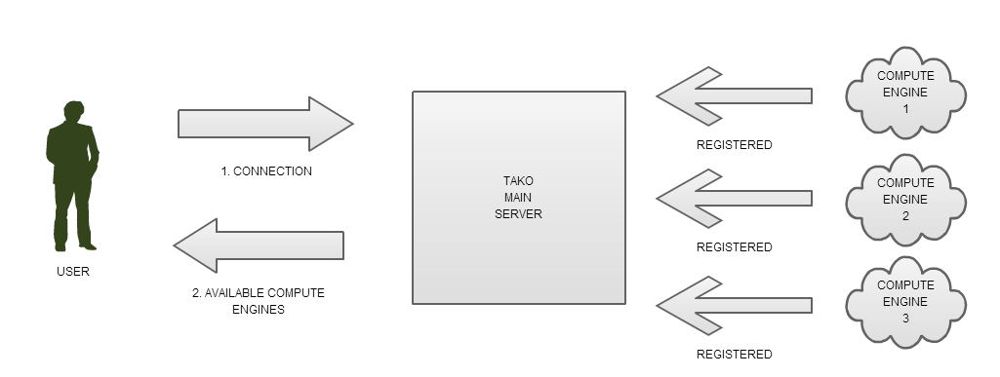
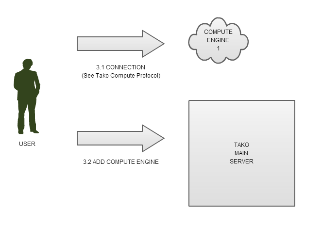

# TAKO SERVER PROTOCOL V1.0 Specification

	Author              : REIS Rui, HEIG-VD
					  	  MESSERLI Antoine, HEIG-VD
	Last revision date  : 30.03.2014

	Revision history

## Table of Contents

1. [Introduction](#Introduction)
2. [Terminology](#Terminology)
3. [Protocol Overview](#ProtocolOverview)
	1. [System Architecture](#SystemArchitecture)
	2. [System Components](#SystemComponents)
		1. [Tako Main Server](#TakoMainServer)
		2. [Compute Engine](#ComputeEngine)
4. [Protocol Details](#ProtocolDetails)
	1. [Syntax and Semantics](#Syntax)
		1. [List of Compute Engines](#ListCompEngines)
		2. [Adding its own Compute Engine](#AddCompEngine)
	2. [Miscellaneous Considerations](#Misc)
	3. [Security Considerations](#Security)
5. [References](#References)

## 1. Introduction

>The Tako Server Protocol (TSP) is the first part of the Tako Cloud Service, a cloud-computing engine. The second part, namely, the Tako Compute Protocol is defined by J. Bischof and H. Haiken [rfc-tako.txt]. The TSP is a stateless protocol and relies on UDP/IP transmission [rfc.768].

>It aims to provide computational engines stored in the cloud. The user connects to a central server which sends the back the available computational engines to which the user can connect. Their implementation is not specified here as they can be coded in any way imaginable.

>This documents explains how to add a computational engine to the Tako Cloud Service as well as how to connect to one.

## 2. Terminology

**TAKO**: octopus

**COMPUTE/COMPUTATIONAL ENGINE**: remote server accepting computation requests

## 3. Protocol Overview

>The user connects first to the Tako Main Server. The server sends a list of available compute engines and has two choices from there.
>
>1. Connect to a compute engine (specification in Tako Compute Protocol)
>
>2. Add his own compute engine (as specified in section 4)

### 3.1. System Architecture

>These diagrams show the interaction between a user and the server.

>The user has then 2 options

### 3.2. System Components

#### 3.2.1. Tako Main Server

>The Tako Main Server receives two types of requests:
>
>1. A [CONNECT] request which is answered by the list of computational engines
>
>2. An [ADD] request in which the the user has to provide the IP of his own computational engine so the server can add it to the list of available engines 

#### 3.2.2. Compute Engine

>A compute engine is a remote server whose IP is known by the Main Server. Its task is to provide the user a list of possible computations. The interaction between an user and a compute engine is specified in the Tako Compute Protocol.

## 4. Protocol Details

>The connection between a user and a server is a stateless connection. For this, we use an UDP connection request upon which the server will answer with the list of available compute engines using the JSON format [rfc.7159]. 

### 4.1. Syntax and Semantics

#### 4.1.1 List of Compute Engines

>The list is sent with a JSON format:

 	 <COMPENGINES_LIST> ::= '{ "COMPENGINES_LIST": ['
        { '{ "IP":' <IP> ', "NAME":' <NAME> ', "STATUS":' ('"PUBLIC"'|'"PRIVATE"') '}' }']}'

#### 4.1.2 Adding its own Compute Engine

>If the user wants to add his own Compute Engine to the list of available ones, he must send the IP on which the remote compute engine server is stored as well as its name and whether it's private or public. The JSON formatting is analog as the previous point:
	 	
	 <ADD_COMPENGINE> ::= '{ "ADD_COMPENGINE":'
        {'{ "IP":' <IP> ', "NAME":' <NAME> ', "STATUS":' ('"PUBLIC"'|'"PRIVATE"') '}'}'}'

### 4.2. Miscellaneous Considerations

>The Main Server does perform a ping to every computational engine before sending the list to a client. However, it does not verify the contents and/or how the computations are done on those remote servers. It does not verify if the computational engine respects the Tako Compute Protocol either, the user must be sure to add a server that other users can use.

### 4.3. Security Considerations

>As specified in point 4.2, there is no verification whatsoever on how the remote computational engines work. A malicious user can abuse this and send malicious pieces of code to any user trying to connect to a his server. One could imagine a special implementation for a compute engine and a verification would be implemented on the Main Server in order to avoid these kind of situations.

## 5. References

>RES course on HEIG-VD:
>https://github.com/wasadigi/Teaching-HEIGVD-RES

>UDP [rfc.768]:
>https://tools.ietf.org/html/rfc768

>JSON [rfc.7159]:
>http://tools.ietf.org/html/rfc7159
